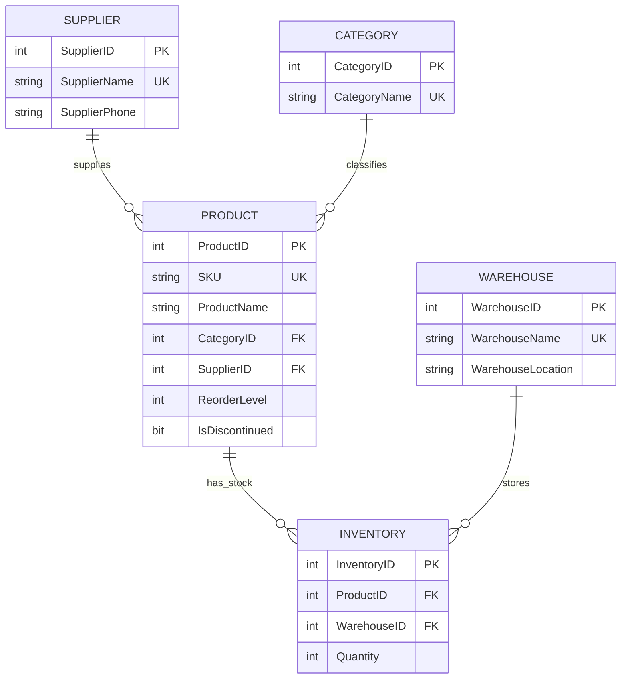

# Set 1 – Retail Inventory ER Diagram

```mermaid
erDiagram
    SUPPLIER ||--o{ PRODUCT : supplies
    CATEGORY ||--o{ PRODUCT : classifies
    PRODUCT ||--o{ INVENTORY : has_stock
    WAREHOUSE ||--o{ INVENTORY : stores

    SUPPLIER {
        int SupplierID PK
        string SupplierName UK
        string SupplierPhone
    }
    CATEGORY {
        int CategoryID PK
        string CategoryName UK
    }
    WAREHOUSE {
        int WarehouseID PK
        string WarehouseName UK
        string WarehouseLocation
    }
    PRODUCT {
        int ProductID PK
        string SKU UK
        string ProductName
        int CategoryID FK
        int SupplierID FK
        int ReorderLevel
        bit IsDiscontinued
    }
    INVENTORY {
        int InventoryID PK
        int ProductID FK
        int WarehouseID FK
        int Quantity
    }
```

MongoDB `reviews` documents refer to products by `sku`; they are not a SQL Server table in this design.
