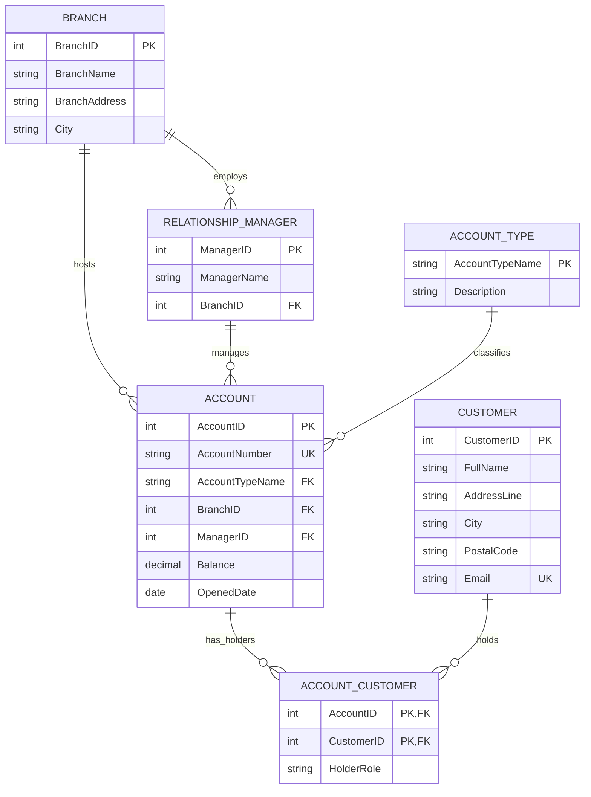

# Set 2 – Bank Accounts ER Diagram

```mermaid
erDiagram
    BRANCH ||--o{ RELATIONSHIP_MANAGER : employs
    BRANCH ||--o{ ACCOUNT : hosts
    RELATIONSHIP_MANAGER ||--o{ ACCOUNT : manages
    ACCOUNT_TYPE ||--o{ ACCOUNT : classifies
    ACCOUNT ||--o{ ACCOUNT_CUSTOMER : has_holders
    CUSTOMER ||--o{ ACCOUNT_CUSTOMER : holds

    CUSTOMER {
        int CustomerID PK
        string FullName
        string AddressLine
        string City
        string PostalCode
        string Email UK
    }
    BRANCH {
        int BranchID PK
        string BranchName
        string BranchAddress
        string City
    }
    ACCOUNT_TYPE {
        string AccountTypeName PK
        string Description
    }
    RELATIONSHIP_MANAGER {
        int ManagerID PK
        string ManagerName
        int BranchID FK
    }
    ACCOUNT {
        int AccountID PK
        string AccountNumber UK
        string AccountTypeName FK
        int BranchID FK
        int ManagerID FK
        decimal Balance
        date OpenedDate
    }
    ACCOUNT_CUSTOMER {
        int AccountID PK,FK
        int CustomerID PK,FK
        string HolderRole
    }
```

MongoDB `customerActivity` stores activity events separately from the SQL account master data.
