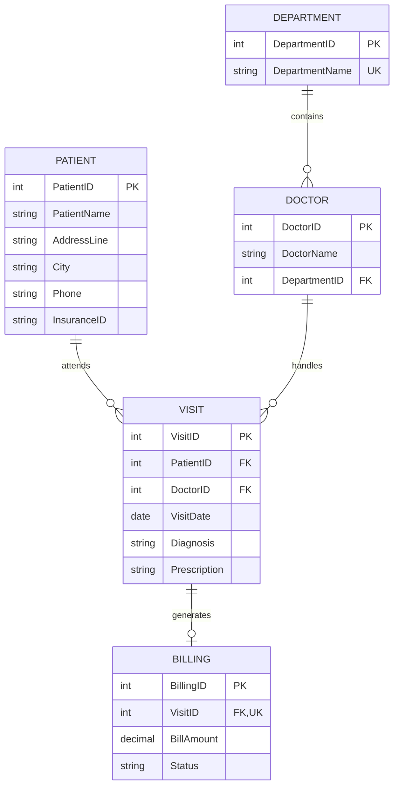

# Set 3 – Hospital Records ER Diagram

```mermaid
erDiagram
    PATIENT ||--o{ VISIT : attends
    DEPARTMENT ||--o{ DOCTOR : contains
    DOCTOR ||--o{ VISIT : handles
    VISIT ||--o| BILLING : generates

    PATIENT {
        int PatientID PK
        string PatientName
        string AddressLine
        string City
        string Phone
        string InsuranceID
    }
    DEPARTMENT {
        int DepartmentID PK
        string DepartmentName UK
    }
    DOCTOR {
        int DoctorID PK
        string DoctorName
        int DepartmentID FK
    }
    VISIT {
        int VisitID PK
        int PatientID FK
        int DoctorID FK
        date VisitDate
        string Diagnosis
        string Prescription
    }
    BILLING {
        int BillingID PK
        int VisitID FK,UK
        decimal BillAmount
        string Status
    }
```

The SQL table is renamed to `PatientBilling` by the ALTER TABLE demonstration. The ER diagram uses the original logical name Billing for readability.
